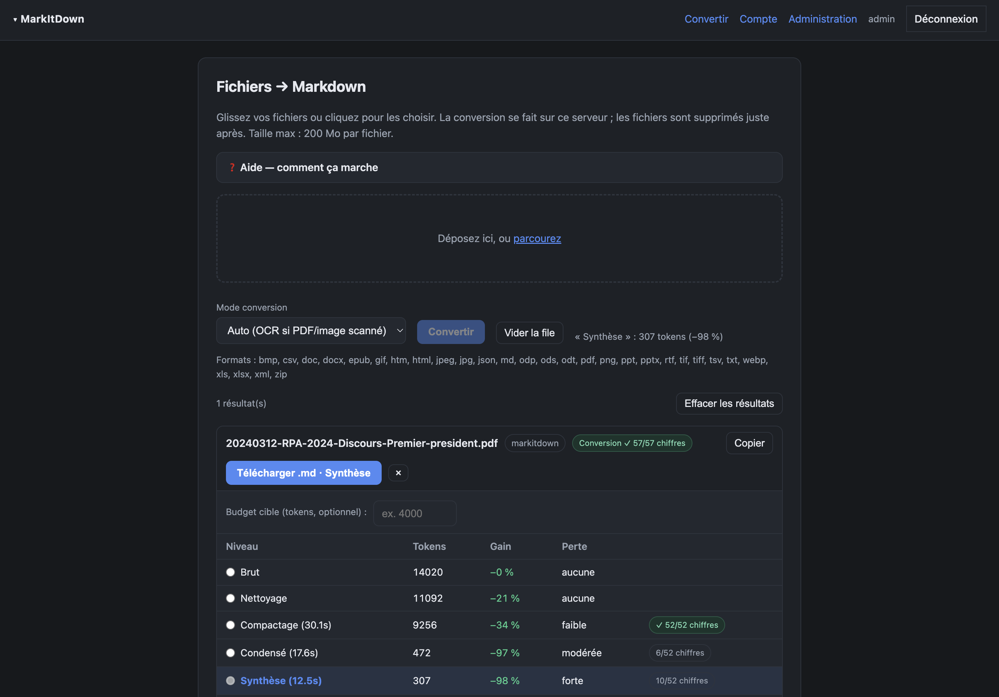

# MarkItDown IA Optimizer

Self-hosted web app that converts documents (PDF, Office, ODT, images…) to **Markdown**,
then **optimizes them for LLMs** — with a deterministic **fidelity control** that guarantees
no numeric value is silently lost along the way.

> Conversion is powered by Microsoft's excellent [MarkItDown](https://github.com/microsoft/markitdown).
> This project adds the layer *around* it: cleanup, token optimization, a fidelity guardrail,
> multi-user auth, and a turnkey deployment.

## Screenshot



*Real example: a public audit report (French Cour des comptes). Converted (conversion fidelity 57/57),
then compacted by −34% while keeping all 52/52 numeric values. Fidelity is verified at conversion and
at each optimization level.*

## Features

- **Convert many formats → Markdown**: MarkItDown (native), **LibreOffice headless**
  (ODT/ODS/ODP, DOC/PPT/RTF) and **OCR** (Tesseract + OCRmyPDF) for scans.
- **Optimizer** — reduce tokens across levels: **Nettoyage** (lossless heuristic cleanup),
  **Compactage** (faithful — guaranteed never larger and never loses a number),
  **Condensé** / **Synthèse** (summaries, loss reported).
- **Fidelity control** — deterministic, local: checks numeric values (amounts, %, years,
  quantities) between the source PDF text layer and the Markdown, and between the Markdown
  and each optimized output. Nothing is lost in silence.
- **Multi-user** with admin-managed accounts, **Argon2id**, **TOTP 2FA**, CSRF, login lockout.
- **Provider-agnostic LLM**: any OpenAI-compatible `/v1/chat/completions` endpoint
  (OpenAI, OVH AI Endpoints, a local Ollama/vLLM…).

## Quick start (Docker)

```bash
git clone https://github.com/<you>/markitdown-ia-optimizer.git
cd markitdown-ia-optimizer
cp .env.example secret.env      # set SESSION_SECRET and your LLM endpoint/key
docker compose up -d --build
```

The app listens on `127.0.0.1:8080`. **Put it behind a TLS reverse proxy** (see `SECURITY.md`).
On first start, a random admin password is written to `data/INITIAL_ADMIN_PASSWORD.txt`
(and the logs) — log in as `admin`, change it, and enable 2FA.

## Configuration

All via environment (`secret.env`, see `.env.example`): `SESSION_SECRET`, `LLM_BASE`,
`LLM_MODEL`, `LLM_API_KEY`, `LLM_MAX_INPUT`, `LLM_MAX_WORKERS`, `MAX_UPLOAD_MB`, `OCR_LANGS`…

## How faithful compaction works

An LLM asked to "compact without loss" tends to *summarize* and drop figures. Two mechanisms
keep **Compactage** honest and safe:

1. **Section-by-section processing** — the document is split into small chunks; on a small
   fragment the model can only trim, not summarize. Chunks are processed in parallel.
2. **Deterministic guard** — a compacted chunk is accepted **only if it is shorter *and* keeps
   every number**; otherwise the original chunk is kept. A final whole-document check falls
   back to the lossless *Nettoyage* if anything is off. Result: Compactage can **never grow**
   and **never loses a number** (worst case, it equals Nettoyage).

*Condensé* and *Synthèse* are summaries by design; their fidelity is shown for information.

## Deployment options

- **Docker / Compose** (recommended) — see above.
- **systemd** — see `deploy/markitdown-web.service` (adjust paths and `FORWARDED_ALLOW_IPS`),
  system deps: `python3-venv tesseract-ocr tesseract-ocr-fra tesseract-ocr-eng ocrmypdf
  poppler-utils libreoffice-writer libreoffice-calc libreoffice-impress`.

## Security

Read **[SECURITY.md](SECURITY.md)** before exposing the app. Short version: TLS reverse proxy,
strong `SESSION_SECRET`, your own LLM key, admin-only accounts + 2FA, isolated container.

## License

MIT — see [LICENSE](LICENSE). Uses [MarkItDown](https://github.com/microsoft/markitdown) (MIT, Microsoft).
